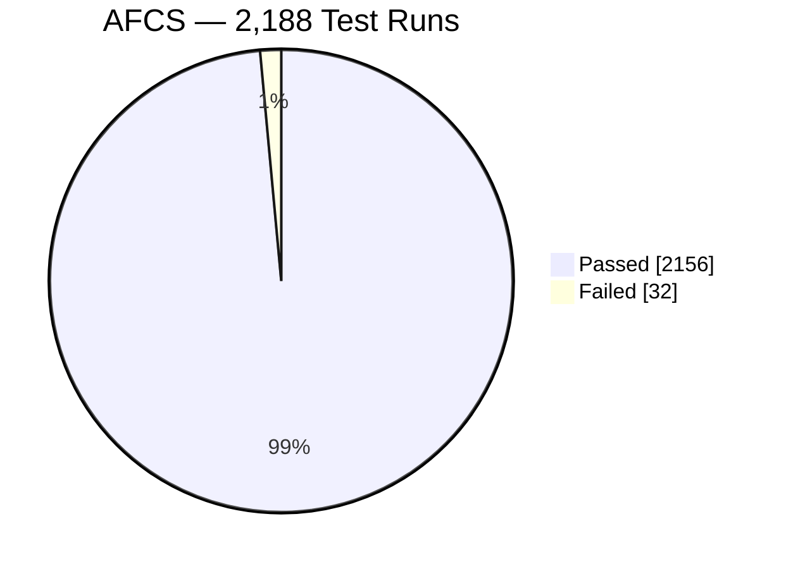

# AI Systems Developer

### *Learn. Unlearn. Relearn.*

 

<!-- LIVE-STATUS:START -->
🟢 Portfolio verified up · last checked 2026-08-06 02:30 UTC
<!-- LIVE-STATUS:END -->

---

### About Me

Computer Engineering graduate and part-time **AI Systems Developer**, building customer-facing conversational AI prototypes and testing them the way production software deserves to be tested. I translate business requirements into prompts, workflows, and acceptance criteria — then validate them with structured smoke, functional, and regression testing before they ship. Previously led a five-member engineering team through a cloud-connected fare collection platform, from spec to a 98.54% functional pass rate across 2,188 test runs.

### The Numbers

### Currently

- 💼 Part-Time **AI Systems Developer** @ Quantum Growth AI Automation Agency — Makati, Philippines (Jul 2026 – Present)
- 📚 Training as an **Associate AI Engineer for Developers** with DataCamp × Data Engineering Pilipinas — OpenAI API, Prompt Engineering, Hugging Face, LLMOps, RAG, Embeddings, Pinecone, LangChain, MCP
- 🎓 BS Computer Engineering, University of Cabuyao — GWA 1.542, Dean's Lister (2023–2024)

---

### 🔨 Currently Building

All private — active client/agency work, happy to walk through architecture and results live.

- 🍸 **AI Bartender** — conversational AI bartender. 39/39 regression checks passing. Shipped. *(full write-up under Featured Projects below, case study: [ai-bartender-showcase](https://github.com/Reniel-Relearn/ai-bartender-showcase))*
- 🛎️ **AI Receptionist** — queuing/check-in kiosk for walk-in visitors (hospitals, universities): AI avatar check-in, QR queue ticket, and a phone alert when it's your turn. Generic, deployment-agnostic core. In development. Case study: [ai-receptionist-showcase](https://github.com/Reniel-Relearn/ai-receptionist-showcase)
- 📊 **AI KPI Dashboards** — KPI/checklist workflow MVP: CEO objectives → department KPIs → employee submissions with evidence → manager approval → automatic scoring → role-specific dashboards. In development. Case study: [ai-kpi-dashboards-showcase](https://github.com/Reniel-Relearn/ai-kpi-dashboards-showcase)
- 🏢 **Client Company Website Redesign** — homepage redesign presentation built from five source-of-truth PDFs and an approved mockup, generated (not hand-assembled) from a content/template/render pipeline. Includes self-built QA tooling: a coverage audit that asserts every PDF-sourced fact actually appears on the rendered page, plus a responsive-overflow check across 375–1920px. Shipped (client presentation deliverable). Repo: [tovv-fctry](https://github.com/Reniel-Relearn/tovv-fctry)

---

### Tech Stack

**Applied AI**

**Programming & Integration**

**Testing & Delivery**

**Dev & Deployment**

---

### Featured Projects

#### 🚌 Automated Fare Collection System
**Team Leader** · Python · Firebase · Raspberry Pi · NFC · GPS · REST APIs

Led a five-member team designing a Python-based, cloud-connected fare collection system with commuter, driver, and administrator interfaces — card validation, terminal-based fare computation, seat allocation and monitoring, and financial analytics. Designed, logged, and executed 2,188 manual test runs across 21 scenarios to validate every functional requirement.

#### 🍸 AI Bartender Conversational Prototype
**AI Systems Developer**
Private prototype — built for Quantum Growth AI Automation Agency

Developed and deployed a conversational AI bartender supporting six approved drinks, explicit order confirmation, one-ticket-per-order behavior, and correct drink-to-video mapping. Designed a 39-check end-to-end smoke and regression suite covering greeting, ordering, confirmation, ticket management, video playback, and session recovery — then diagnosed and resolved defects in video mapping, duplicate orders, and overlapping AI responses through iterative test-fix-retest cycles.

**Other Projects:** 🪖 [Smart Glass Helmet](https://github.com/Reniel-Relearn/smart-glass-helmet) — ESP32-S3 wearable safety system for tunnel workers with real-time environmental sensing, OLED alerts, and Firebase logging.

---

<picture>
  <source media="(prefers-color-scheme: dark)" srcset="https://github-readme-stats.vercel.app/api?username=Reniel-Relearn&show_icons=true&theme=tokyonight&hide_title=true&hide_border=true" />
  <source media="(prefers-color-scheme: light)" srcset="https://github-readme-stats.vercel.app/api?username=Reniel-Relearn&show_icons=true&theme=default&hide_title=true&hide_border=true" />
  
</picture>
<picture>
  <source media="(prefers-color-scheme: dark)" srcset="https://github-readme-streak-stats.herokuapp.com/?user=Reniel-Relearn&theme=tokyonight&hide_border=true" />
  <source media="(prefers-color-scheme: light)" srcset="https://github-readme-streak-stats.herokuapp.com/?user=Reniel-Relearn&hide_border=true" />
  
</picture>

 

